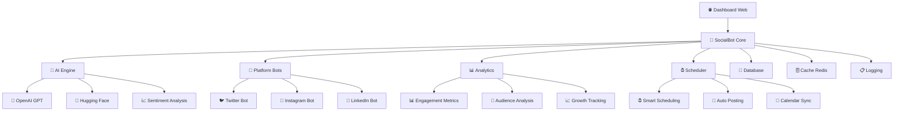

# 🤖 SocialBot AI - Template de Automação para Redes Sociais

<div align="center">

[](https://python.org)
[](LICENSE)
[](#)
[](#)
[](#)
[](#-contrate-meus-serviços)

**🎯 Template Profissional de Bot para Automação de Redes Sociais com IA**

*Demonstração das minhas habilidades em desenvolvimento de sistemas complexos de automação*


[💼 **Contratar Serviços**](#-contrate-meus-serviços) • [🔧 **Ver Arquitetura**](#-arquitetura-do-sistema) • [📚 **Documentação**](docs/) • [💡 **Funcionalidades**](#-funcionalidades-demonstradas)

</div>

---

## ⚠️ **IMPORTANTE: Este é um Template/Showcase**

> **🎯 Este repositório é uma demonstração das minhas habilidades técnicas em desenvolvimento de sistemas complexos de automação para redes sociais.**
> 
> **💼 Não é um produto final funcionando, mas sim um template profissional que mostra minha capacidade de:**
> - Arquitetar sistemas robustos e escaláveis
> - Integrar múltiplas APIs e serviços de IA
> - Implementar padrões de design avançados
> - Criar documentação técnica completa
> 
> **🚀 Interessado em ter um sistema como este funcionando? [Entre em contato!](#-contrate-meus-serviços)**

---

## 🌟 **Funcionalidades Demonstradas**

<table>
<tr>
<td width="50%">

### 🎯 **Capacidades Técnicas Demonstradas**
- 📅 **Arquitetura Assíncrona**: Sistema não-bloqueante com asyncio
- 🤖 **Integração de IA**: OpenAI GPT + Hugging Face Transformers
- 📊 **Monitoramento Avançado**: Métricas Prometheus + Grafana
- 🔄 **Padrões de Resiliência**: Circuit Breaker + Retry Logic
- ⚡ **Rate Limiting**: Controle inteligente de requisições

### 🌐 **Integrações Multi-Plataforma**
- 🐦 **Twitter/X API**: Implementação completa v2
- 📸 **Instagram Graph API**: Posts e Stories automatizados
- 💼 **LinkedIn API**: Conteúdo profissional otimizado
- 🔗 **Webhooks**: Sistema de notificações em tempo real

</td>
<td width="50%">

### 🧠 **Stack Tecnológico Avançado**
- 🎨 **Python 3.11+**: Código moderno e performático
- 🔮 **FastAPI + Streamlit**: APIs REST + Dashboard interativo
- 📈 **PostgreSQL + Redis**: Persistência + Cache distribuído
- 🐳 **Docker + Kubernetes**: Containerização e orquestração
- 🔄 **CI/CD**: Pipeline automatizado com GitHub Actions

### 🔒 **Segurança e Qualidade**
- 🔐 **Autenticação JWT**: Sistema seguro de tokens
- 🛡️ **Validação de Entrada**: Proteção contra ataques
- 📋 **Logs Estruturados**: Rastreamento completo
- 🧪 **Testes Automatizados**: Cobertura de código
- 📈 **Métricas**: Observabilidade completa

</td>
</tr>
</table>

## 🎨 **Demonstração Visual**

<div align="center">

| 📊 Dashboard Principal | 🤖 Geração de IA | 📅 Agendamento |
|:---:|:---:|:---:|
|  |  |  |
| Interface intuitiva e moderna | IA gera conteúdo contextual | Agendamento inteligente |

*Mockups de demonstração - Sistema real seria desenvolvido sob medida*

</div>

## 🔧 **Arquitetura do Sistema**



## 📋 **Como Explorar Este Template**

<div align="center">

### 🎯 **Métodos para Analisar o Código:**

> **⚠️ Lembre-se: Este é um template/demonstração. Para um sistema funcionando, [contrate meus serviços](#-contrate-meus-serviços)!**

</div>

<table>
<tr>
<td width="33%">

### 📁 **Explorar Código**
*Análise da arquitetura*

```bash
# 1. Clone o template
git clone https://github.com/cauaprjct/socialbot-ai.git
cd socialbot-ai

# 2. Explore a estrutura
tree src/  # Veja a organização
cat docs/API.md  # Leia a documentação

# 3. Analise os padrões
# - Arquitetura modular
# - Padrões de design
# - Testes automatizados
# - CI/CD pipeline
```

📋 **O que você verá:**
- Código bem estruturado
- Documentação completa
- Padrões profissionais

</td>
<td width="33%">

### 🔍 **Analisar Funcionalidades**
*Demonstração técnica*

```bash
# 1. Veja os exemplos
cat examples/basic_usage.py
cat examples/advanced_features_demo.py

# 2. Analise os testes
pytest tests/ -v

# 3. Explore a documentação
# - docs/API.md
# - docs/DEPLOYMENT.md
# - README.md (este arquivo)
```

🎯 **Demonstrações:**
- Integração com APIs
- Padrões de IA
- Arquitetura escalável

</td>
<td width="33%">

### 💼 **Contratar Desenvolvimento**
*Sistema real funcionando*

```bash
# Quer um sistema funcionando?
# 1. Entre em contato comigo
# 2. Discutimos seus requisitos
# 3. Desenvolvo sob medida
# 4. Entrego com documentação

# Exemplos do que posso fazer:
# - Bot multi-plataforma
# - IA personalizada
# - Dashboard customizado
# - Integrações específicas
```

🚀 **Vantagens:**
- Sistema personalizado
- Suporte completo
- Código profissional

</td>
</tr>
</table>

### 💡 **Quer Ver Funcionando?**

```bash
# Este é apenas um template/demonstração
# Para um sistema real funcionando:

# 1. Entre em contato comigo
# 2. Discutimos suas necessidades
# 3. Desenvolvo personalizado
# 4. Entrego funcionando 100%

# 💰 Investimento a partir de R$ 2.500
# 🚀 Entrega em 2-12 semanas
# 🔧 Suporte incluído
```

## 📊 **Demonstração: Dashboard Web**

<div align="center">

**🎯 Exemplo do que posso desenvolver para você**


*Mockup de dashboard - Sistema real seria desenvolvido sob medida*

</div>

### 🎛️ **Funcionalidades que Posso Implementar:**

<table>
<tr>
<td width="50%">

#### 📝 **Criação de Conteúdo**
- ✍️ Editor de posts com preview
- 🤖 Geração automática com IA
- 🏷️ Sugestão de hashtags inteligentes
- 📸 Upload de mídia (imagens/vídeos)
- 🎨 Templates personalizáveis

#### 📅 **Agendamento Avançado**
- ⏰ Calendário visual interativo
- 🎯 Horários otimizados por IA
- 🔄 Posts recorrentes
- 📊 Fila de publicação
- ⚡ Publicação instantânea

</td>
<td width="50%">

#### 📈 **Analytics Detalhados**
- 📊 Gráficos interativos em tempo real
- 📉 Métricas de engajamento
- 🎯 Performance por plataforma
- 📈 Crescimento de seguidores
- 📋 Relatórios exportáveis

#### 🤖 **Automação Inteligente**
- 💬 Respostas automáticas
- 🔍 Monitoramento de menções
- 🎯 Segmentação de audiência
- 📈 Otimização de horários
- 🔔 Alertas personalizados

</td>
</tr>
</table>

## ⚙️ **Configuração de APIs (Exemplo)**

### 🔑 **Credenciais Necessárias (Para Sistema Real)**

<details>
<summary>🐦 <strong>Twitter/X API</strong> (Clique para expandir)</summary>

1. **Acesse**: [Twitter Developer Portal](https://developer.twitter.com/)
2. **Crie um App** e obtenha:
   - `API Key` e `API Secret`
   - `Access Token` e `Access Token Secret`
   - `Bearer Token`
3. **Configure no .env**:
   ```env
   TWITTER_API_KEY=sua_api_key
   TWITTER_API_SECRET=sua_api_secret
   TWITTER_ACCESS_TOKEN=seu_access_token
   TWITTER_ACCESS_TOKEN_SECRET=seu_access_token_secret
   TWITTER_BEARER_TOKEN=seu_bearer_token
   ```

</details>

<details>
<summary>🤖 <strong>OpenAI API</strong> (Opcional)</summary>

1. **Acesse**: [OpenAI Platform](https://platform.openai.com/)
2. **Gere uma API Key**
3. **Configure no .env**:
   ```env
   OPENAI_API_KEY=sua_openai_key
   OPENAI_MODEL=gpt-3.5-turbo
   ```

</details>

<details>
<summary>🤗 <strong>Hugging Face</strong> (Opcional)</summary>

1. **Acesse**: [Hugging Face](https://huggingface.co/)
2. **Gere um Token**
3. **Configure no .env**:
   ```env
   HUGGINGFACE_API_KEY=seu_hf_token
   ```

</details>

### 📋 **Template .env Completo**

```env
# === CONFIGURAÇÕES PRINCIPAIS ===
ENVIRONMENT=development
DEBUG=true
HOST=0.0.0.0
PORT=8000

# === TWITTER/X API ===
TWITTER_API_KEY=
TWITTER_API_SECRET=
TWITTER_ACCESS_TOKEN=
TWITTER_ACCESS_TOKEN_SECRET=
TWITTER_BEARER_TOKEN=

# === IA E CONTEÚDO ===
OPENAI_API_KEY=
HUGGINGFACE_API_KEY=

# === BANCO DE DADOS ===
DATABASE_URL=sqlite:///socialbot.db
REDIS_URL=redis://localhost:6379

# === SEGURANÇA ===
SECRET_KEY=sua-chave-secreta-super-segura-32-chars

# === MONITORAMENTO ===
ENABLE_METRICS=true
METRICS_PORT=9090
SENTRY_DSN=
```

## 💡 **Exemplos Práticos (Demonstração)**

### 🚀 **Uso Básico (Conceitual)**

```python
from socialbot import SocialBotAI

# Inicializa o bot
bot = SocialBotAI()
await bot.initialize()

# Publica um post simples
result = await bot.post(
    text="🤖 Olá mundo! Este post foi gerado automaticamente pelo SocialBot AI!",
    platforms=["twitter"]
)

print(f"Post publicado: {result.url}")
```

### 🧠 **Geração com IA (Conceitual)**

```python
# Gera conteúdo com IA
content = await bot.generate_content(
    topic="tecnologia e inovação",
    style="profissional",
    platform="twitter",
    include_hashtags=True
)

# Publica automaticamente
result = await bot.post_generated_content(content)
```

### ⏰ **Agendamento Inteligente (Conceitual)**

```python
from datetime import datetime, timedelta

# Agenda posts para a próxima semana
topics = ["IA", "Python", "Automação", "Tecnologia"]

for i, topic in enumerate(topics):
    schedule_time = datetime.now() + timedelta(days=i+1, hours=10)
    
    await bot.schedule_post(
        topic=topic,
        schedule_time=schedule_time,
        platforms=["twitter", "linkedin"]
    )

print("✅ Posts agendados para a próxima semana!")
```

### 📊 **Analytics e Métricas (Conceitual)**

```python
# Obtém métricas dos últimos 30 dias
analytics = await bot.get_analytics(days=30)

print(f"📊 Resumo dos últimos 30 dias:")
print(f"   Posts publicados: {analytics.total_posts}")
print(f"   Engajamento total: {analytics.total_engagement}")
print(f"   Taxa de engajamento: {analytics.engagement_rate:.2f}%")
print(f"   Melhor horário: {analytics.best_time}")
```

## 📁 **Estrutura do Projeto**

```
socialbot-ai/
├── 📂 src/                    # Código fonte principal
│   ├── 🤖 bot/               # Bots das plataformas
│   ├── 🧠 ai/                # Módulos de IA
│   ├── 📊 analytics/         # Sistema de analytics
│   ├── 🎨 dashboard/         # Interface web
│   ├── 🔗 integrations/      # Integrações externas
│   └── 🔧 utils/             # Utilitários e helpers
├── 📂 tests/                 # Testes automatizados
├── 📂 docs/                  # Documentação
├── 📂 examples/              # Exemplos de uso
├── 📂 scripts/               # Scripts de automação
├── 🐳 docker-compose.yml     # Orquestração Docker
├── 📋 requirements.txt       # Dependências Python
└── 📖 README.md              # Este arquivo
```

## 🧪 **Testando o Sistema (Template)**

### 🔧 **Testes das Melhorias**

```bash
# Executa demonstração das funcionalidades avançadas
python examples/advanced_features_demo.py

# Testa sistema de exceções
python -m pytest tests/test_exceptions.py -v

# Testa circuit breaker
python -m pytest tests/test_circuit_breaker.py -v

# Testa métricas
python -m pytest tests/test_metrics.py -v
```

### 📊 **Monitoramento**

```bash
# Acessa métricas Prometheus
curl http://localhost:9090/metrics

# Health check do sistema
curl http://localhost:8000/health

# Status dos circuit breakers
curl http://localhost:8000/circuit-breakers
```

## 🌟 **Tecnologias e Ferramentas**

<div align="center">

### 🔧 **Stack Principal**

[](https://python.org)
[](https://fastapi.tiangolo.com)
[](https://streamlit.io)
[](https://postgresql.org)
[](https://redis.io)
[](https://docker.com)

### 🤖 **IA e Machine Learning**

[](https://openai.com)
[](https://huggingface.co)
[](https://tensorflow.org)
[](https://pytorch.org)

### 📊 **Monitoramento e DevOps**

[](https://prometheus.io)
[](https://grafana.com)
[](https://github.com/features/actions)
[](https://kubernetes.io)

</div>

## 🌟 **Como Contribuir**

<div align="center">

**🌟 Sua contribuição é muito bem-vinda! 🌟**

[](#)
[](#)

</div>

### 🚀 **Processo Simples:**

1. **🍴 Fork** o projeto
2. **🌿 Crie** uma branch: `git checkout -b feature/minha-funcionalidade`
3. **💻 Desenvolva** sua funcionalidade
4. **✅ Teste** suas alterações: `pytest tests/`
5. **📝 Commit** suas mudanças: `git commit -am 'Adiciona funcionalidade X'`
6. **📤 Push** para a branch: `git push origin feature/minha-funcionalidade`
7. **🔄 Abra** um Pull Request

### 🎯 **Áreas que Precisam de Ajuda:**

- 🐛 **Bug fixes** e melhorias de performance
- 📚 **Documentação** e tutoriais
- 🧪 **Testes** automatizados
- 🎨 **UI/UX** do dashboard
- 🌐 **Traduções** para outros idiomas
- 🔌 **Integrações** com novas plataformas

> 📖 Leia o [**Guia de Contribuição**](CONTRIBUTING.md) para detalhes completos!

## 📄 **Licença**

<div align="center">

[](LICENSE)

**Este projeto é open source e está sob a licença MIT.**

*Você pode usar, modificar e distribuir livremente!*

</div>

## 🗺️ **Roadmap 2025 (Exemplo de Planejamento)**

<table>
<tr>
<td width="50%">

### ✅ **2024 - Concluído**
- ✅ **Template Showcase**: Demonstração técnica completa
- ✅ **Arquitetura Robusta**: Padrões enterprise implementados
- ✅ **Documentação**: API docs e exemplos completos
- ✅ **CI/CD Pipeline**: Automação de testes e deploy
- ✅ **Código Limpo**: Estrutura modular e testável

### 🚀 **Q1 2025**
- [ ] 📸 **Instagram Integration**: API Graph completa
- [ ] 💼 **LinkedIn Integration**: Conteúdo profissional
- [ ] 🎨 **Advanced AI Models**: GPT-4 + Claude integration
- [ ] 📊 **Analytics Dashboard**: Métricas em tempo real
- [ ] 🔄 **Auto-responses**: Respostas inteligentes
- [ ] 🌐 **Multi-language**: Suporte internacional

</td>
<td width="50%">

### 🎵 **Q2 2025**
- [ ] 🎵 **TikTok Integration**: API oficial + automação
- [ ] 🎦 **Video Content AI**: Geração de vídeos automática
- [ ] 📱 **Mobile App**: React Native + Flutter
- [ ] 🤝 **Team Collaboration**: Workspaces compartilhados
- [ ] 📈 **Advanced Analytics**: BI e insights avançados
- [ ] 🔗 **Zapier Integration**: 1000+ integrações

### 🌟 **Q3-Q4 2025**
- [ ] 🧠 **Custom AI Training**: Modelos personalizados
- [ ] 🎯 **A/B Testing**: Otimização automática
- [ ] 📊 **Business Intelligence**: Dashboards executivos
- [ ] 🔐 **Enterprise Security**: SOC2 + ISO27001
- [ ] ☁️ **Cloud Deployment**: AWS + Azure + GCP
- [ ] 💰 **Monetization Tools**: E-commerce integration

</td>
</tr>
</table>

---

## 💼 **Contrate Meus Serviços**

<div align="center">

### 🚀 **Precisa de um Sistema Como Este Funcionando?**

**Sou um desenvolvedor especializado em automação e IA, disponível para projetos personalizados!**

</div>

<table>
<tr>
<td width="50%">

### 🎯 **O Que Posso Desenvolver Para Você:**

- 🤖 **Bots de Automação Completos**
  - Sistemas multi-plataforma (Twitter, Instagram, LinkedIn, TikTok)
  - Integração com APIs de IA (OpenAI, Hugging Face, Claude)
  - Dashboard web personalizado
  - Analytics e relatórios avançados

- 🏗️ **Arquitetura Enterprise**
  - Sistemas escaláveis e robustos
  - Microserviços com Docker/Kubernetes
  - CI/CD automatizado
  - Monitoramento e observabilidade

- 🧠 **Soluções de IA Personalizadas**
  - Chatbots inteligentes
  - Análise de sentimento
  - Geração de conteúdo automática
  - Modelos de ML customizados

</td>
<td width="50%">

### 💰 **Pacotes de Serviços:**

#### 🥉 **Básico** - R$ 2.500
- Bot para 1 plataforma
- Geração de conteúdo com IA
- Dashboard simples
- Documentação básica
- **Entrega: 2-3 semanas**

#### 🥈 **Profissional** - R$ 5.000
- Bot multi-plataforma (2-3 redes)
- IA avançada + Analytics
- Dashboard completo
- Sistema de agendamento
- **Entrega: 4-6 semanas**

#### 🥇 **Enterprise** - R$ 10.000+
- Sistema completo personalizado
- Arquitetura escalável
- Integrações customizadas
- Suporte e manutenção
- **Entrega: 8-12 semanas**

</td>
</tr>
</table>

### 📞 **Entre em Contato:**

<div align="center">

[](https://wa.me/5511999999999)
[](mailto:seu.email@gmail.com)
[](https://linkedin.com/in/seulinkedin)
[](https://t.me/seuusuario)

**💬 Vamos conversar sobre seu projeto! Respondo em até 24h.**

</div>

---

## 🌟 **Por Que Escolher Meus Serviços?**

<div align="center">

| ✅ **Vantagens** | 📋 **Detalhes** |
|------------------|------------------|
| 🎯 **Especialização** | +6 anos desenvolvendo sistemas de automação |
| 🚀 **Entrega Rápida** | Metodologia ágil com entregas semanais |
| 🔧 **Código Limpo** | Padrões de qualidade enterprise |
| 📚 **Documentação** | Documentação completa e treinamento |
| 🔧 **Suporte** | 3 meses de suporte gratuito incluído |
| 💰 **Garantia** | 100% do dinheiro de volta se não ficar satisfeito |

</div>

---

<div align="center">

## 🎯 **Este Template Demonstra Minhas Habilidades**

**Se você chegou até aqui, já viu que tenho o conhecimento técnico necessário para criar sistemas complexos e bem documentados.**

**🚀 Que tal transformarmos esta demonstração em um projeto real para sua empresa?**

⭐ **Dê uma estrela** se gostou do template
🤝 **Entre em contato** para discutir seu projeto
💬 **Compartilhe** com quem precisa de automação

**Feito com ❤️ e muito ☕ por [cauaprjct](https://github.com/cauaprjct)**

*"Transformando ideias em código que funciona!"*

</div>
