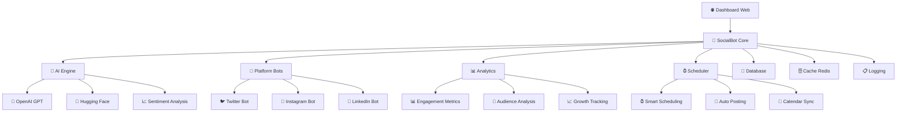

# 🤖 **SocialBot AI** - Bot de Automação para Redes Sociais

<div align="center">

[](https://python.org)
[](LICENSE)
[](Dockerfile)
[](#)
[](#)

**🚀 Automatize suas redes sociais com IA de última geração!**

[📖 Documentação](#-documentação) • [🚀 Instalação](#-instalação-em-3-minutos) • [💡 Exemplos](#-exemplos-práticos) • [🤝 Contribuir](#-contribuindo)

---

### 🌟 **Transforme sua presença digital com automação inteligente**

</div>

## 🎯 **Visão Geral**

O **SocialBot AI** é uma solução completa de automação para redes sociais que combina **inteligência artificial avançada** com **arquitetura robusta de produção**. Publique conteúdo automaticamente, responda interações e analise engajamento em múltiplas plataformas.

<table>
<tr>
<td width="50%">

### 📱 **Plataformas Suportadas**
- 🐦 **Twitter/X**: Posts, threads, respostas automáticas
- 📸 **Instagram**: Stories, posts, reels (em desenvolvimento)
- 💼 **LinkedIn**: Conteúdo profissional otimizado
- 🎵 **TikTok**: Em desenvolvimento (próxima versão)

</td>
<td width="50%">

### 🧠 **IA de Última Geração**
- 🎨 **Hugging Face Transformers**: Modelos de linguagem avançados
- 🔮 **OpenAI Integration**: GPT para conteúdo premium
- 📈 **Análise de Sentimento**: Multi-modelo para precisão máxima
- 🎯 **Targeting Inteligente**: Audiência certa, hora certa
- 🔍 **Trend Detection**: Detecta tendências automaticamente

### 🛠 **Integrações Poderosas**
- 📅 **Google Calendar**: Sincroniza com seus eventos
- 📊 **Banco de Dados**: PostgreSQL/SQLite para dados
- 🗃️ **APIs RESTful**: Integre com qualquer ferramenta
- 🔗 **Webhooks**: Automação completa de workflows

</td>
</tr>
</table>

## 🎬 **Demo em Ação**

<div align="center">

| 📊 Dashboard Principal | 🤖 Geração de IA | 📅 Agendamento |
|:---:|:---:|:---:|
|  |  |  |
| Interface intuitiva e moderna | IA gera conteúdo contextual | Agendamento inteligente |

</div>

## 🛡️ **Arquitetura de Produção** ⭐ **NOVO!**

<div align="center">

### 🏗️ **Sistema Robusto e Escalável**

</div>

<table>
<tr>
<td width="50%">

### 🔧 **Resiliência Avançada**
- **🔄 Circuit Breaker**: Proteção contra falhas em cascata
- **⚡ Retry Inteligente**: Backoff exponencial com jitter
- **🏥 Health Checks**: Monitoramento automático de saúde
- **🚨 Exception Handling**: Sistema robusto de tratamento de erros
- **⏱️ Timeout Management**: Controle inteligente de timeouts

### 📊 **Observabilidade Completa**
- **📈 Métricas Prometheus**: Monitoramento profissional
- **📋 Logs Estruturados**: Rich formatting e contexto
- **🎯 Tracing Distribuído**: Análise de performance
- **🔍 Error Tracking**: Sentry integration
- **📊 Custom Dashboards**: Grafana ready

</td>
<td width="50%">

### ⚡ **Performance Otimizada**
- **🔗 Connection Pooling**: Reutilização eficiente de conexões
- **💾 Cache Distribuído**: Redis para alta performance
- **🔀 Load Balancing**: Distribuição inteligente de carga
- **📦 Async Architecture**: Processamento não-bloqueante
- **🎛️ Rate Limiting**: Controle avançado de requisições

### 🔒 **Segurança Enterprise**
- **🔐 API Key Encryption**: Credenciais protegidas
- **🛡️ Input Validation**: Validação robusta de entrada
- **📝 Audit Logging**: Rastreamento de todas as ações
- **🚫 Rate Limiting**: Proteção contra abuso
- **🔑 JWT Authentication**: Autenticação segura

</td>
</tr>
</table>

## 🚀 **Instalação em 3 Minutos**

<div align="center">

### 🎯 **Escolha seu método preferido:**

</div>

<table>
<tr>
<td width="33%">

### 🐳 **Docker (Recomendado)**
*Mais fácil e rápido*

```bash
# 1. Clone o projeto
git clone https://github.com/cauaprjct/socialbot-ai.git
cd socialbot-ai

# 2. Configure APIs
cp .env.example .env
# Edite .env com suas credenciais

# 3. Execute tudo
docker-compose up -d

# 4. Acesse o dashboard
# http://localhost:8501
```

✅ **Vantagens:**
- Setup automático
- Banco de dados incluído
- Pronto para produção

</td>
<td width="33%">

### 🐍 **Python Local**
*Controle total*

```bash
# 1. Clone e configure
git clone https://github.com/cauaprjct/socialbot-ai.git
cd socialbot-ai

# 2. Ambiente virtual
python -m venv venv
source venv/bin/activate  # Linux/Mac
# venv\Scripts\activate  # Windows

# 3. Instale dependências
pip install -r requirements.txt

# 4. Configure e execute
cp .env.example .env
python run.py
```

✅ **Vantagens:**
- Desenvolvimento ágil
- Debug facilitado
- Customização total

</td>
<td width="33%">

### ⚡ **Setup Automático**
*Um comando só*

```bash
# 1. Clone o projeto
git clone https://github.com/cauaprjct/socialbot-ai.git
cd socialbot-ai

# 2. Execute setup automático
chmod +x scripts/setup.sh
./scripts/setup.sh

# 3. Configure APIs
# O script vai guiá-lo

# 4. Pronto!
# Dashboard já estará rodando
```

✅ **Vantagens:**
- Zero configuração
- Detecção automática
- Guia interativo

</td>
</tr>
</table>

## ⚙️ **Configuração de APIs**

### 🔑 **Credenciais Necessárias**

<details>
<summary>🐦 <strong>Twitter/X API</strong> (Clique para expandir)</summary>

1. **Acesse**: [Twitter Developer Portal](https://developer.twitter.com/)
2. **Crie um App** e obtenha:
   - `API Key` e `API Secret`
   - `Access Token` e `Access Token Secret`
   - `Bearer Token`
3. **Configure no .env**:
   ```env
   TWITTER_API_KEY=sua_api_key
   TWITTER_API_SECRET=sua_api_secret
   TWITTER_ACCESS_TOKEN=seu_access_token
   TWITTER_ACCESS_TOKEN_SECRET=seu_access_token_secret
   TWITTER_BEARER_TOKEN=seu_bearer_token
   ```

</details>

<details>
<summary>🤖 <strong>OpenAI API</strong> (Opcional)</summary>

1. **Acesse**: [OpenAI Platform](https://platform.openai.com/)
2. **Gere uma API Key**
3. **Configure no .env**:
   ```env
   OPENAI_API_KEY=sua_openai_key
   OPENAI_MODEL=gpt-3.5-turbo
   ```

</details>

<details>
<summary>🤗 <strong>Hugging Face</strong> (Opcional)</summary>

1. **Acesse**: [Hugging Face](https://huggingface.co/)
2. **Gere um Token**
3. **Configure no .env**:
   ```env
   HUGGINGFACE_API_KEY=seu_hf_token
   ```

</details>

### 📋 **Template .env Completo**

```env
# === CONFIGURAÇÕES PRINCIPAIS ===
ENVIRONMENT=development
DEBUG=true
HOST=0.0.0.0
PORT=8000

# === TWITTER/X API ===
TWITTER_API_KEY=
TWITTER_API_SECRET=
TWITTER_ACCESS_TOKEN=
TWITTER_ACCESS_TOKEN_SECRET=
TWITTER_BEARER_TOKEN=

# === IA E CONTEÚDO ===
OPENAI_API_KEY=
HUGGINGFACE_API_KEY=

# === BANCO DE DADOS ===
DATABASE_URL=sqlite:///socialbot.db
REDIS_URL=redis://localhost:6379

# === SEGURANÇA ===
SECRET_KEY=sua-chave-secreta-super-segura-32-chars

# === MONITORAMENTO ===
ENABLE_METRICS=true
METRICS_PORT=9090
SENTRY_DSN=
```

## 💡 **Exemplos Práticos**

### 🚀 **Uso Básico**

```python
from socialbot import SocialBotAI

# Inicializa o bot
bot = SocialBotAI()
await bot.initialize()

# Publica um post simples
result = await bot.post(
    text="🤖 Olá mundo! Este post foi gerado automaticamente pelo SocialBot AI!",
    platforms=["twitter"]
)

print(f"Post publicado: {result.url}")
```

### 🧠 **Geração com IA**

```python
# Gera conteúdo com IA
content = await bot.generate_content(
    topic="tecnologia e inovação",
    style="profissional",
    platform="twitter",
    include_hashtags=True
)

# Publica automaticamente
result = await bot.post_generated_content(content)
```

### ⏰ **Agendamento Inteligente**

```python
from datetime import datetime, timedelta

# Agenda posts para a próxima semana
topics = ["IA", "Python", "Automação", "Tecnologia"]

for i, topic in enumerate(topics):
    schedule_time = datetime.now() + timedelta(days=i+1, hours=10)
    
    await bot.schedule_post(
        topic=topic,
        schedule_time=schedule_time,
        platforms=["twitter", "linkedin"]
    )

print("✅ Posts agendados para a próxima semana!")
```

### 📊 **Analytics e Métricas**

```python
# Obtém métricas dos últimos 30 dias
analytics = await bot.get_analytics(days=30)

print(f"📊 Resumo dos últimos 30 dias:")
print(f"   Posts publicados: {analytics.total_posts}")
print(f"   Engajamento total: {analytics.total_engagement}")
print(f"   Taxa de engajamento: {analytics.engagement_rate:.2f}%")
print(f"   Melhor horário: {analytics.best_time}")
```

## 🏗️ **Arquitetura do Sistema**



## 📁 **Estrutura do Projeto**

```
socialbot-ai/
├── 📂 src/                    # Código fonte principal
│   ├── 🤖 bot/               # Bots das plataformas
│   ├── 🧠 ai/                # Módulos de IA
│   ├── 📊 analytics/         # Sistema de analytics
│   ├── 🎨 dashboard/         # Interface web
│   ├── 🔗 integrations/      # Integrações externas
│   └── 🛠️ utils/             # Utilitários e helpers
├── 📂 tests/                 # Testes automatizados
├── 📂 docs/                  # Documentação
├── 📂 examples/              # Exemplos de uso
├── 📂 scripts/               # Scripts de automação
├── 🐳 docker-compose.yml     # Orquestração Docker
├── 📋 requirements.txt       # Dependências Python
└── 📖 README.md              # Este arquivo
```

## 🧪 **Testando o Sistema**

### 🔧 **Testes das Melhorias**

```bash
# Executa demonstração das funcionalidades avançadas
python examples/advanced_features_demo.py

# Testa sistema de exceções
python -m pytest tests/test_exceptions.py -v

# Testa circuit breaker
python -m pytest tests/test_circuit_breaker.py -v

# Testa métricas
python -m pytest tests/test_metrics.py -v
```

### 📊 **Monitoramento**

```bash
# Acessa métricas Prometheus
curl http://localhost:9090/metrics

# Health check do sistema
curl http://localhost:8000/health

# Status dos circuit breakers
curl http://localhost:8000/circuit-breakers
```

## 🗺️ **Roadmap 2024**

<table>
<tr>
<td width="25%">

### 🎯 **Q1 2024**
- ✅ **Core MVP**
- ✅ **Twitter Integration**
- ✅ **Basic AI Content**
- ✅ **Docker Support**
- ✅ **Circuit Breaker**
- ✅ **Metrics System**

</td>
<td width="25%">

### 🚀 **Q2 2024**
- 📸 **Instagram Integration**
- 💼 **LinkedIn Integration**
- 🎨 **Advanced AI Models**
- 📊 **Analytics Dashboard**
- 🔄 **Auto-responses**
- 🌐 **Multi-language**

</td>
<td width="25%">

### 🎵 **Q3 2024**
- 🎵 **TikTok Integration**
- 🎬 **Video Content AI**
- 📱 **Mobile App**
- 🤝 **Team Collaboration**
- 📈 **Advanced Analytics**
- 🔗 **Zapier Integration**

</td>
<td width="25%">

### 🌟 **Q4 2024**
- 🧠 **Custom AI Training**
- 🎯 **A/B Testing**
- 📊 **Business Intelligence**
- 🔐 **Enterprise Security**
- ☁️ **Cloud Deployment**
- 💰 **Monetization Tools**

</td>
</tr>
</table>

## 🤝 **Contribuindo**

Adoramos contribuições! Veja como você pode ajudar:

### 🎯 **Como Contribuir**

1. **🍴 Fork** o projeto
2. **🌿 Crie** uma branch (`git checkout -b feature/AmazingFeature`)
3. **💾 Commit** suas mudanças (`git commit -m 'Add some AmazingFeature'`)
4. **📤 Push** para a branch (`git push origin feature/AmazingFeature`)
5. **🔄 Abra** um Pull Request

### 🐛 **Reportando Bugs**

Encontrou um bug? [Abra uma issue](https://github.com/cauaprjct/socialbot-ai/issues) com:
- 📝 Descrição detalhada
- 🔄 Passos para reproduzir
- 💻 Ambiente (OS, Python version, etc.)
- 📸 Screenshots (se aplicável)

### 💡 **Sugerindo Features**

Tem uma ideia incrível? [Abra uma issue](https://github.com/cauaprjct/socialbot-ai/issues) com:
- 🎯 Descrição da feature
- 🤔 Por que seria útil
- 💭 Como deveria funcionar

## 📄 **Licença**

Este projeto está licenciado sob a Licença MIT - veja o arquivo [LICENSE](LICENSE) para detalhes.

## 🙏 **Agradecimentos**

- 🤗 **Hugging Face** pela incrível biblioteca de transformers
- 🔮 **OpenAI** pelos modelos GPT revolucionários
- 🐦 **Twitter** pela API robusta
- 🐍 **Python Community** pelo ecossistema fantástico
- 🌟 **Todos os contribuidores** que tornam este projeto possível

## 📞 **Suporte**

- 📖 **Documentação**: [Wiki do Projeto](https://github.com/cauaprjct/socialbot-ai/wiki)
- 💬 **Discussões**: [GitHub Discussions](https://github.com/cauaprjct/socialbot-ai/discussions)
- 🐛 **Issues**: [GitHub Issues](https://github.com/cauaprjct/socialbot-ai/issues)
- 📧 **Email**: socialbot.ai@gmail.com

---

<div align="center">

### 🌟 **Se este projeto te ajudou, deixe uma ⭐!**

**Feito com ❤️ por [cauaprjct](https://github.com/cauaprjct)**

[⬆️ Voltar ao topo](#-socialbot-ai---bot-de-automação-para-redes-sociais)

</div>